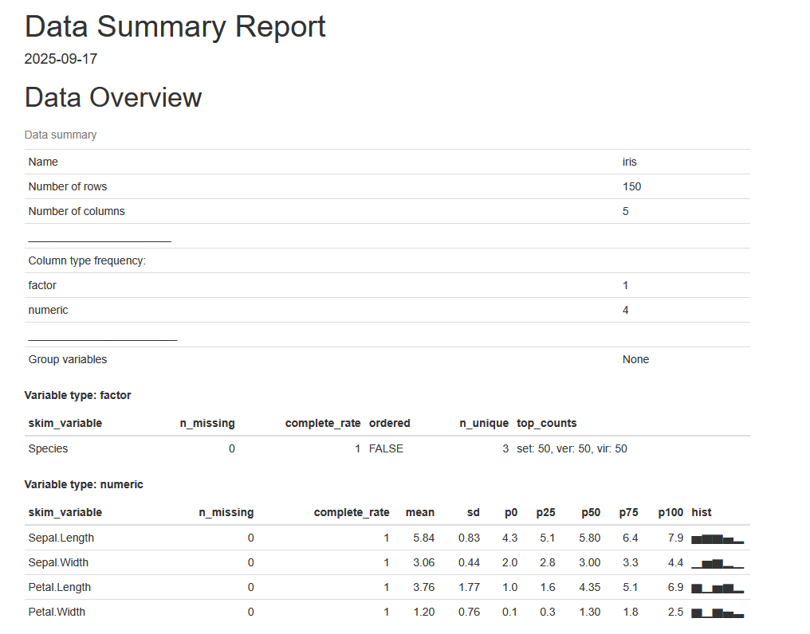
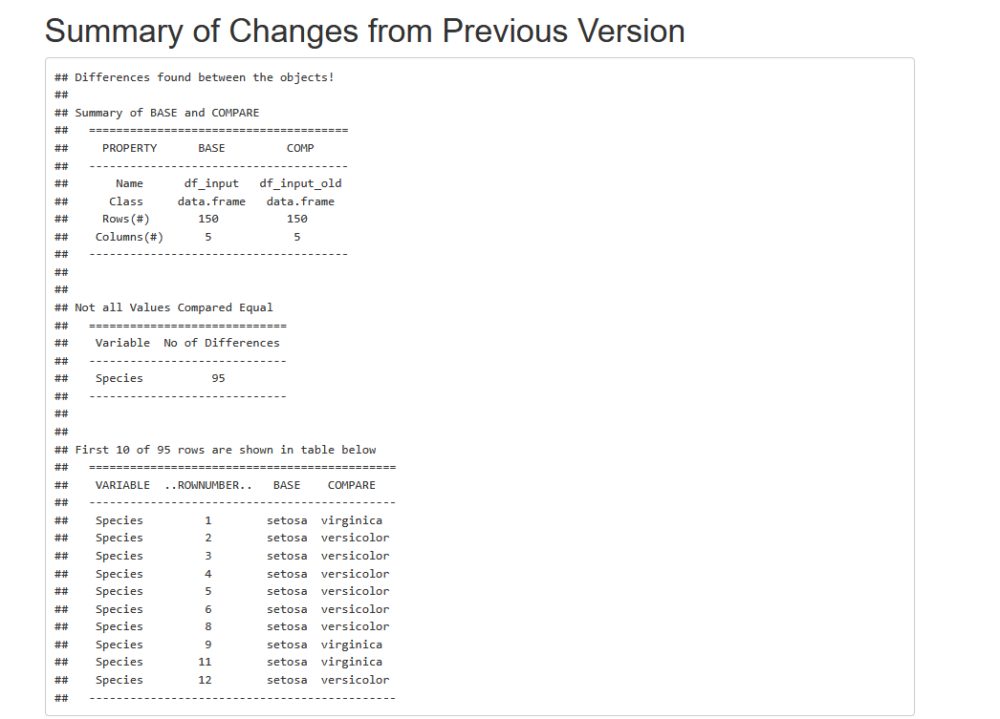

```{r, include = FALSE}
knitr::opts_chunk$set(collapse = T, comment = "#>")
```

```{r, setup}
library(datareportR)
```

# Rendering the data report

**datareportR** consists of a small but powerful function, render_data_report(), which takes input data and outputs a "data report" as a pdf or HTML document. The generated report allows an analyst to:

1. **View** summary statistics on the entire dataset, such as the mean and quartiles of numeric variables, and number of unique values for categorical variables.

2. **Compare** the data with an old version and to see a printout of differences.

Both of these functions are explained in more detail below.

## Viewing summary statistics

datareportR can generate a view of your data that summarizes numerical and categorical columns (e.g., quantiles, mean, and standard deviation for numeric columns and category frequency for categorical columns), as well as presenting key metadata associated with the dataset, such as number of rows, number of columns, and number of numeric/categorical columns. Under the hood, it uses the powerful `skim::skimr()` function.

A sample call on the `iris` dataset is as follows and renders the following output:

```{r, eval=FALSE}
iris = datasets::iris
datareportR::render_data_report(df_input = iris, save_report_dir = tempdir())
```




## Comparing the data

datareportR also allows you to compare an input dataset with another dataset and to 
inspect the differences. This provides you a readout of (a) columns with differing values, along
with the number of differing values, and (b) the first 10 rows of differences for each column.Under the hood, this uses the `diffdf::diffdf()` function.

Below is a sample call on the `iris` dataset and comparing it to a permuted version:

```{r, eval=FALSE}
set.seed(12345)

iris = datasets::iris
iris_permuted = iris

# Randomly switch the order of the Species column
iris_permuted$Species <- sample(iris$Species)

datareportR::render_data_report(
  df_input = iris, 
  df_input_old = iris_permuted, 
  save_report_dir = tempdir()
)
```



## Only including one section

By default, both the data overview and data comparison sections of the report are included.
You can choose to not include one section by specifying `include_skim = FALSE` or `include_diffdf = FALSE` in the function all. Note that you cannot set both options to be `FALSE`; datareportR will complain and throw an error if so.

For example, to disable the data comparison section, use the following function call:

```{r, eval=FALSE}
datareportR::render_data_report(
  df_input = iris, 
  save_report_dir = tempdir(),
  include_diffdf = FALSE
)
```


## Output format options

Currently supported output formats for the report are HTML and pdf. `output_format` in the function
call must be specified as "html" (the default) or "pdf". To save the report as a pdf, for example, use this following function call:

```{r, eval=FALSE}
datareportR::render_data_report(
  df_input = iris, 
  save_report_dir = tempdir(),
  output_format = "pdf"
)
```

# Save options

datareportR allows you to control the save location for (a) the raw data report markdown file and (b) the final data report. These are specified via the `save_rmd_dir`/`save_rmd_file` and `save_report_dir`/`save_report_file` arguments, respectively. By default, all arguments are configured to save the Markdown file and output report in the current working directory.

## Saving the raw markdown file

If you'd like to save the underlying RMarkdown file for the data report, specify a `save_rmd_dir`. This argument accepts the following: 

1. `NULL`: the underlying file will not be saved to disk.

2. Folder path: e.g., `output/`: the underlying file will be saved to that folder path.

Similarly, `save_rmd_file` accepts a full file path with .Rmd extension: e.g., `output/data_report.Rmd`. In this case, `render_data_report()` will save the underlying RMarkdown file to the directory in the file name. This option allows you to change the name of the `.Rmd` file saved. A .Rmd extension will be appended automatically if it is not detected.

You can specify both `save_rmd_dir` and `save_rmd_file`, but they must be consistent with each other (i.e., have the same folder path). datareportR will complain and throw an error otherwise.

## Saving the report

Similarly, `save_report_dir` accepts the following:

1. `NULL`: the data report will be saved in the current working directory.

2. Folder path: the report will be saved to that folder.

Specify `save_report_file` as a full file path e.g., `output/data_report.html`, to save the output report to that file.A .html or .pdf extension will be appended automatically if it is not detected.  This option allows you to change the name of the saved report.

## Example

For instance, to save the data report RMarkdown file in the `output` directory and the report itself as `iris_report.html` in the `output` directory, use the following function call:

```{r, eval=FALSE}
datareportR::render_data_report(
  df_input = iris,
  save_rmd_dir = "output/",
  save_report_file = "output/iris_report.html"
)
```


## Errors

Note that datareportR will complain if any directories it is being asked to save to do not exist.


